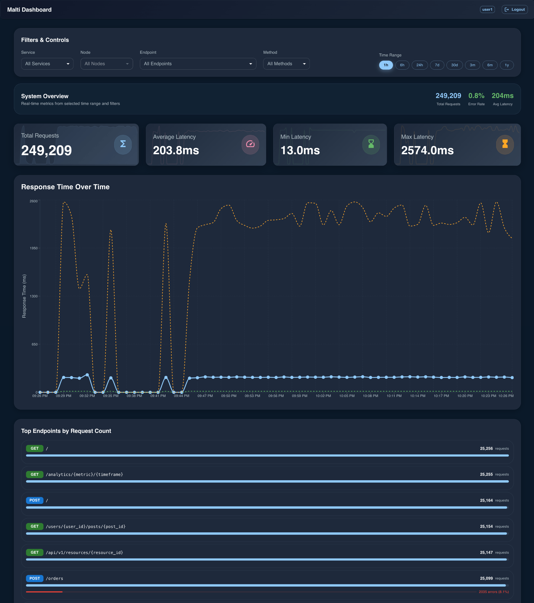

# Malti - Monitoring and Latency Tracking Interface

[](https://python.org)
[](https://fastapi.tiangolo.com)
[](https://timescale.com)
[](https://reactjs.org)
[](https://docker.com)
[](https://github.com)

> **🏠 Self-Hosted Telemetry Solution** - Keep your data private, secure, and under your control

Malti is a comprehensive **self-hosted** telemetry collection and visualization system designed for monitoring application performance and load metrics. It provides real-time insights into HTTP request patterns, response times, error rates, and system health across multiple services and nodes - all running on your own infrastructure.

## 🚀 Features

### Core Capabilities
- **🏠 Self-Hosted**: Complete control over your data and infrastructure
- **🔒 Data Privacy**: No third-party services, all data stays on your servers
- **💰 Cost-Effective**: No per-request fees or subscription costs
- **⚡ Real-time Telemetry Collection**: Automatic HTTP request monitoring with minimal overhead
- **🌐 Multi-Service Support**: Monitor multiple services and nodes 
- **📊 Time-Series Analytics**: Built on TimescaleDB for efficient time-series data storage and querying
- **🎨 Interactive Dashboard**: Modern React-based web interface with Material-UI components
- **🔌 API-First Design**: RESTful API for both data ingestion and querying
- **🛡️ Rate Limiting**: Built-in protection against abuse and overload

### Dashboard Features


*Malti Dashboard - Real-time telemetry monitoring interface*

- **Real-time Metrics**: Live telemetry data visualization with 1-minute resolution
- **Interactive Filtering**: Filter by service, node, endpoint, method, request context, and time range
- **Multiple Visualizations**: 
  - Response time trends over time
  - Top endpoints by request count
  - Consumer distribution analysis
  - System health indicators
  - Error rate monitoring
- **Responsive Design**: Optimized for desktop, tablet, and mobile devices
- **Time Range Selection**: Quick access to 1h, 6h, 24h, 7d, 30d, 3m, 6m, 1y data

### Data Management
- **Automatic Aggregation**: Continuous aggregates for 5-minute and 1-hour intervals
- **Data Retention**: Configurable retention policies for raw and aggregated data
- **Batch Processing**: Efficient batch ingestion with overflow protection
- **Connection Pooling**: Optimized database connections for high throughput

## 🏗️ Architecture

### Backend (FastAPI + TimescaleDB)
```
┌─────────────────┐    ┌─────────────────┐    ┌─────────────────┐
│   Services      │    │   Malti API     │    │  TimescaleDB    │
│   (Your Apps)   │───▶│   (FastAPI)     │───▶│   (Database)    │
└─────────────────┘    └─────────────────┘    └─────────────────┘
                              │
                              ▼
                       ┌─────────────────┐
                       │   Dashboard     │
                       │   (React)       │
                       └─────────────────┘
```

### Key Components
- **API Layer**: FastAPI with async/await support
- **Database**: TimescaleDB with hypertables and continuous aggregates
- **Authentication**: Service and user API key management
- **Rate Limiting**: SlowAPI-based request throttling
- **Frontend**: React with Material-UI and Recharts

## 🏠 Self-Hosting Guide

### Why Self-Host Malti?

**🔒 Complete Data Control**
- Your telemetry data never leaves your infrastructure
- No third-party access to sensitive application metrics
- Full compliance with data residency requirements

**💰 Cost Predictability**
- No per-request fees or usage-based pricing
- Predictable infrastructure costs
- No vendor lock-in or subscription dependencies

**⚡ Performance & Reliability**
- No network latency to external services
- No dependency on external service availability

**🔧 Customization**
- Modify and extend functionality as needed
- Integrate with your existing monitoring stack
- Custom retention policies and data processing

### Self-Hosting Requirements

**Minimum System Requirements:**
- **CPU**: 2 cores
- **RAM**: 4GB (8GB recommended for production)
- **Storage**: 20GB SSD (more for longer retention)
- **Network**: Stable internet connection

**Recommended for Production:**
- **CPU**: 4+ cores
- **RAM**: 16GB+
- **Storage**: 100GB+ SSD with backup strategy
- **Network**: High-bandwidth, low-latency connection

## 📦 Installation

### Prerequisites
- Docker and Docker Compose
- Node.js 20+ (for development)
- Python 3.12+ (for development)

### 🚀 Quick Self-Hosting Setup

1. **Clone the repository:**
   ```bash
   git clone <repository-url>
   cd malti
   ```

2. **Configure for your environment:**
   ```bash
   # Edit configuration file
   cp config/malti.toml config/malti.production.toml
   # Update API keys, service names, and settings
   ```

3. **Start your self-hosted instance:**
   ```bash
   docker-compose -f docker-compose.dev.yml up -d
   ```

4. **Access your private dashboard:**
   Open http://your-server:8000 in your browser

5. **Login with your configured credentials:**

### Development Setup

1. **Backend Development:**
   ```bash
   # Install Python dependencies
   pip install -r requirements.txt
   
   # Start TimescaleDB
   docker-compose -f docker-compose.dev.yml up -d timescaledb
   
   # Run the backend
   uvicorn app.main:app --reload --host 0.0.0.0 --port 8000
   ```

2. **Frontend Development:**
   ```bash
   cd dashboard
   npm install
   npm run dev
   ```

3. **Run Tests:**
   ```bash
   python test/run_tests.py
   ```

## 🔧 Configuration

### Service Configuration (`config/malti.toml`)

```toml
[services]
[services.user-service]
api_key = "user-service-key"
description = "User management service"

[services.test-service]
api_key = "test-service-key"
description = "Test service"

[users]
# Define users who can query metrics
[users.user1]
username = "user1"
api_key = "user-api-key"

[api]
base_url = "http://localhost:8000"
ingest_endpoint = "/api/v1/ingest"
metrics_endpoint = "/api/v1/metrics"

[aggregation]
batch_size = 1000
batch_interval_seconds = 60
```

### Environment Variables

#### Backend Configuration
- `DATABASE_URL`: PostgreSQL connection string
- `MALTI_CONFIG_PATH`: Path to configuration file
- `LOG_LEVEL`: Logging level (DEBUG, INFO, WARNING, ERROR)

#### Client Library Configuration
- `MALTI_SERVICE_NAME`: Service name for telemetry
- `MALTI_API_KEY`: Service API key
- `MALTI_URL`: Malti server URL
- `MALTI_NODE`: Node identifier
- `MALTI_BATCH_SIZE`: Batch size for telemetry (default: 500)
- `MALTI_BATCH_INTERVAL`: Batch interval in seconds (default: 60)

## 📊 API Reference

### Authentication
All API endpoints require authentication via the `X-API-Key` header.

**Service API Keys**: Used for data ingestion (`/api/v1/ingest`)
**User API Keys**: Used for data querying (`/api/v1/metrics/*`)

### Core Endpoints

#### Data Ingestion
```http
POST /api/v1/ingest
Content-Type: application/json
X-API-Key: your-service-api-key

{
  "requests": [
    {
      "service": "auth-service",
      "method": "POST",
      "endpoint": "/api/v1/login",
      "status": 200,
      "response_time": 150,
      "consumer": "web-app",
      "node": "node-1",
      "created_at": "2025-01-01T12:00:00Z"
    }
  ]
}
```

#### Metrics Querying
```http
GET /api/v1/metrics/aggregate?service=auth-service&start_time=2025-01-01T00:00:00Z&end_time=2025-01-01T23:59:59Z
X-API-Key: your-user-api-key
```

#### Real-time Metrics
```http
GET /api/v1/metrics/aggregate/realtime?service=auth-service
X-API-Key: your-user-api-key
```

#### Authentication Test
```http
GET /api/v1/auth/test
X-API-Key: your-user-api-key
```

### Query Parameters

| Parameter | Type | Description |
|-----------|------|-------------|
| `service` | string | Filter by service name |
| `node` | string | Filter by node identifier |
| `method` | string | Filter by HTTP method |
| `endpoint` | string | Filter by endpoint pattern |
| `consumer` | string | Filter by consumer identifier |
| `start_time` | datetime | Start time for query (ISO format) |
| `end_time` | datetime | End time for query (ISO format) |
| `interval` | string | Aggregation interval (5min, 1hour) |

## 🔌 Integration

### Python/FastAPI Integration

```python
# Configure via environment variables
import os
os.environ['MALTI_SERVICE_NAME'] = 'my-service'
os.environ['MALTI_API_KEY'] = 'my-service-api-key'
os.environ['MALTI_URL'] = 'http://localhost:8000'

from fastapi import FastAPI
from malti_telemetry.middleware import MaltiMiddleware

app = FastAPI()

# Add telemetry middleware (route patterns automatically extracted!)
app.add_middleware(MaltiMiddleware)
```

### Other Python/Starlette Integrations

For Starlette-based frameworks (like FastAPI), check out our [Python/Starlette integration package](https://github.com/muzy/malti-telemetry/tree/main/python-starlette) which provides middleware and utilities for seamless telemetry collection.


## 📈 Dashboard Usage

### Time Range Selection
- **1 Hour**: Real-time data with 1-minute resolution
- **6 Hours**: 5-minute aggregated data
- **24 Hours**: 5-minute aggregated data
- **7 Days**: 1-hour aggregated data
- **30 Days**: 1-hour aggregated data
- **3 Months**: 1-hour aggregated data
- **6 Months**: 1-hour aggregated data
- **1 Year**: 1-hour aggregated data

### Filtering Options
- **Service**: Select specific services to monitor
- **Node**: Filter by specific nodes (requires service selection)
- **Endpoint**: Filter by specific API endpoints
- **Time Range**: Quick selection buttons for common time periods

### Visualizations
- **Metrics Cards**: Overview of total requests, average latency, error rates
- **Status Indicator**: System health overview with color-coded status
- **Latency Chart**: Response time trends with min/max/average lines
- **Endpoints Chart**: Top endpoints by request count with error indicators
- **Consumer Chart**: Request distribution by consumer type

## 🗄️ Database Schema

### Request Data Table (`requests`)

| Column         | Type        | Required | Description |
|---------------|-------------|----------|-------------|
| service       | TEXT        | Yes      | Name of the service generating the request, must match service name in `malti.toml` |
| node          | TEXT        | No       | Identifier of the specific service instance/node, configured on each node individually |
| method        | TEXT        | Yes      | HTTP method used (GET, POST, etc.) |
| created_at    | TIMESTAMPTZ | Yes      | Timestamp when the request was received |
| endpoint      | TEXT        | Yes      | API endpoint that was called, typically generalized (e.g. no url params) |
| context       | TEXT        | No       | Additional context or metadata about the request |
| status        | SMALLINT    | Yes      | HTTP status code of the response |
| response_time | INT         | Yes      | Request processing time in milliseconds |
| consumer      | TEXT        | Yes      | Identifier of the client/consumer making the request, set by the application |

### Continuous Aggregates
- **5-minute aggregates**: `requests_5min` (90-day retention)
- **1-hour aggregates**: `requests_1hour` (720-day retention)

### Default Data Retention Policies
- **Raw data**: 6 hours
- **5-minute aggregates**: 90 days
- **1-hour aggregates**: 720 days

## 🧪 Testing

### Running Tests
```bash
# Run all tests
python test/run_tests.py

# Run specific test modules
python -c "from test.test_health import TestHealthEndpoints; TestHealthEndpoints().run_all_tests()"
python -c "from test.test_ingest import TestIngestEndpoint; TestIngestEndpoint().run_all_tests()"
python -c "from test.test_metrics import TestMetricsEndpoints; TestMetricsEndpoints().run_all_tests()"
```

### Test Coverage
- ✅ Health endpoints
- ✅ Authentication and authorization
- ✅ Data ingestion validation
- ✅ Metrics querying with filters
- ✅ Rate limiting
- ✅ Error handling

## 🚀 Self-Hosting Deployment

### 🏭 Production Self-Hosting Setup

1. **Prepare Your Server:**
   ```bash
   # Update system packages
   sudo apt update && sudo apt upgrade -y
   
   # Install Docker and Docker Compose
   curl -fsSL https://get.docker.com -o get-docker.sh
   sudo sh get-docker.sh
   sudo usermod -aG docker $USER
   ```

2. **Configure Your Self-Hosted Instance:**
   ```bash
   # Clone and configure
   git clone <repository-url>
   cd malti
   
   # Create production configuration
   cp config/malti.toml config/malti.production.toml
   
   # Edit with your settings:
   # - Generate secure API keys
   # - Configure your services
   # - Set up user accounts
   # - Adjust retention policies
   ```

3. **Deploy with Caddy (Recommended - Automatic HTTPS):**
   ```bash
   # Use the production Docker Compose with Caddy
   cp .env.prod.example .env.prod
   # Edit .env.prod with your domain and database password
   
   # Deploy with automatic HTTPS
   docker-compose -f docker-compose.prod.yml --env-file .env.prod up -d
   ```

4. **Health Check Your Self-Hosted Instance:**
   ```bash
   # Check if services are running
   docker-compose -f docker-compose.prod.yml ps
   
   # Test HTTPS endpoint
   curl https://yourdomain.com/health
   
   # Check Caddy logs
   docker-compose -f docker-compose.prod.yml logs caddy
   ```

### 📊 Self-Hosting Monitoring

**System Monitoring:**
```bash
# Monitor resource usage
docker stats

# Check logs (production with Caddy)
docker-compose -f docker-compose.prod.yml logs -f malti-backend
docker-compose -f docker-compose.prod.yml logs -f caddy
docker-compose -f docker-compose.prod.yml logs -f timescaledb

# Database monitoring
docker exec -it malti-timescaledb psql -U malti_user -d malti -c "SELECT * FROM timescaledb_information.hypertables;"

# Check Caddy automatic HTTPS status
docker exec -it malti-caddy caddy list-certificates
```

**Backup Strategy:**
```bash
# Database backup
docker exec malti-timescaledb pg_dump -U malti_user malti > backup_$(date +%Y%m%d_%H%M%S).sql

# Configuration backup
cp -r config/ backups/config_$(date +%Y%m%d_%H%M%S)/
```

### 🔄 Self-Hosting Updates

**Zero-Downtime Updates:**
```bash
# Pull latest changes
git pull origin main

# Rebuild and restart (production with Caddy)
docker-compose -f docker-compose.prod.yml down
docker-compose -f docker-compose.prod.yml pull
docker-compose -f docker-compose.prod.yml --env-file .env.prod up -d

# Verify update
curl https://yourdomain.com/health

### 🛡️ Self-Hosting Security

**Network Security:**
- Use firewalls to restrict access
- Implement VPN access for remote monitoring
- Use strong API keys and rotate regularly
- Caddy provides automatic SSL/TLS encryption

**Data Security:**
- Regular database backups
- Encrypted storage volumes
- Access logging and monitoring
- Regular security updates
- Caddy automatic certificate management

## 🔒 Self-Hosting Security

### 🛡️ Data Privacy & Control
- **Complete Data Ownership**: All telemetry data remains on your infrastructure
- **No External Dependencies**: No third-party services or data sharing
- **Compliance Ready**: Meet GDPR, HIPAA, and other regulatory requirements
- **Audit Trail**: Full control over access logs and data retention

### 🔐 Authentication & Authorization
- **Service API Keys**: For data ingestion (configured in `malti.toml`)
- **User API Keys**: For dashboard access and metrics querying
- **Rate Limiting**: Prevents abuse of authentication endpoints
- **Role-Based Access**: Granular permissions for different user types

### 🏠 Self-Hosting Security Best Practices
- **Network Isolation**: Run on private networks with VPN access
- **API Key Management**: Rotate keys regularly and use strong passwords
- **SSL/TLS Encryption**: Always use HTTPS in production
- **Database Security**: Restrict network access to TimescaleDB
- **Regular Updates**: Keep system and dependencies updated
- **Backup Strategy**: Regular encrypted backups of data and configuration
- **Monitoring**: Monitor authentication logs and access patterns
- **Firewall Rules**: Restrict access to necessary ports only

## 📝 Development

### Project Structure
```
malti/
├── app/                   # FastAPI backend
│   ├── api/               # API routes
│   ├── core/              # Core functionality
│   ├── models/            # Data models
│   ├── services/          # Business logic
│   └── static/            # Built dashboard files
├── dashboard/             # React frontend
│   ├── src/               # Source code
│   ├── public/            # Static assets
│   └── package.json       # Dependencies
├── config/                # Configuration files
├── database/              # Database initialization
├── lib/                   # Client library
├── test/                  # Test suite
└── docker-compose.*.yml   # Docker configuration
```

### Adding New Features
1. **Backend**: Add routes in `app/api/`, services in `app/services/`
2. **Frontend**: Add components in `dashboard/src/components/`
3. **Database**: Update schema in `database/init.sql`
4. **Tests**: Add tests in `test/` directory

### Code Style
- **Python**: Follow PEP 8, use type hints
- **JavaScript**: ESLint configuration included
- **Database**: Use proper indexing and query optimization

## 🤝 Contributing

1. Fork the repository
2. Create a feature branch
3. Make your changes
4. Add tests for new functionality
5. Run the test suite
6. Submit a pull request

## 📄 License

This project is licensed under the MIT License - see the LICENSE file for details.

## 🆘 Self-Hosting Support

### 🏠 Self-Hosting Troubleshooting

**Common Self-Hosting Issues:**

1. **"Connection refused" errors**: 
   - Ensure TimescaleDB is running: `docker-compose -f docker-compose.dev.yml ps`
   - Check firewall settings and port accessibility
   - Verify Docker network connectivity

2. **Authentication failures**: 
   - Check API keys in your `malti.toml` configuration
   - Verify service and user key configurations
   - Ensure proper file permissions on config files

3. **Dashboard not loading**: 
   - Verify backend is running on port 8000
   - Check reverse proxy configuration if using one
   - Ensure SSL certificates are valid

4. **No data in dashboard**: 
   - Check service API keys and data ingestion
   - Verify network connectivity from your services to Malti
   - Check database connection and data retention policies

5. **Performance issues**:
   - Monitor system resources: `docker stats`
   - Check database query performance
   - Review batch sizes and intervals

**Self-Hosting Debugging:**
```bash
# Check all services status
docker-compose -f docker-compose.prod.yml ps

# View logs
docker-compose -f docker-compose.prod.yml logs -f malti-backend
docker-compose -f docker-compose.dev.prod logs -f timescaledb

# Test database connectivity
docker exec -it malti-timescaledb psql -U malti_user -d malti -c "SELECT version();"

# Check API health
curl http://localhost:8000/health

# Verify configuration
docker exec -it malti-backend cat /app/config/malti.production.toml
```

### 🚀 Self-Hosting Performance Tuning

**For High-Volume Self-Hosting:**
- **Database Optimization**: Increase TimescaleDB memory settings
- **Batch Processing**: Tune batch sizes and intervals for your workload
- **Connection Pooling**: Optimize database connection settings
- **Storage**: Use SSD storage for better I/O performance
- **Network**: Ensure high-bandwidth connections for data ingestion

**Resource Monitoring:**
```bash
# Monitor system resources
htop
docker stats

# Database performance
docker exec -it malti-timescaledb psql -U malti_user -d malti -c "SELECT * FROM pg_stat_activity;"

# Check TimescaleDB hypertables
docker exec -it malti-timescaledb psql -U malti_user -d malti -c "SELECT * FROM timescaledb_information.hypertables;"
```

### 🌐 Alternatives to Self-Hosting

**Disclaimer:** Malti is not affiliated with the services listed below and is not compatible with their libraries or APIs. These are independent alternatives with different features and integrations, offering a SaaS solution to API monitoring.

#### 🏆 **Apitally** ([apitally.io](https://apitally.io/))
A modern API monitoring and analytics platform with:
- Real-time API metrics and error tracking
- Request logging with privacy controls
- Custom alerts and uptime monitoring
- Support for FastAPI, Flask, Django, Express, NestJS, and more
- Developer-friendly with minimal code changes

#### 📊 **API Analytics** ([apianalytics.dev](https://www.apianalytics.dev/))
Open-source alternative for API monitoring with:
- Framework integrations for FastAPI, Flask, Django, Express, NestJS, and more
- Real-time analytics dashboard
- Error tracking and performance monitoring
- Automated active health checks for resources
- Self-hosted option available

#### 🙏 **Inspiration & Acknowledgments**
Special thanks to **Apitally** and **API Analytics** for inspiring the development of Malti as a lightweight self-hosted alternative.